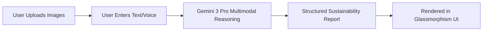

# 🌱 Eco Audit

> **AI-Powered Sustainability Auditor for Small Businesses**  
> Built with **Google AI Studio** and **Gemini 3 Pro** during the **Google DeepMind Vibe Coding Hackathon 2025**

[](https://deepmind.google/)
[](https://aistudio.google.com/)
[](#license)

[EcoAudit Preview]


EcoAudit empowers small and medium businesses (SMEs) to reduce waste, cut costs, and improve sustainability—**without experts or complex tools**. Simply upload photos of your workspace, describe your operations in plain language, and receive an instant, personalized sustainability report powered by **Gemini 3 Pro’s native multimodal reasoning**.

No coding. No consultants. Just actionable AI.

---

## 🌟 Features

- **📸 Multimodal AI Analysis**: Simultaneously interprets **images + text** to detect real-world waste (e.g., plastic, inefficient layouts, energy misuse)
- **📊 EcoScore™**: 0–100 sustainability rating with clear performance labels
- **🔍 Context-Aware Insights**: Observations tied directly to your uploaded images (e.g., *“Plastic wrap visible in Image 2”*)
- **⚡ Tiered Action Plan**: Recommendations ranked by **Impact** (High / Medium / Low)
- **💎 Premium B2B UI**: Dark theme, glassmorphism cards, smooth micro-interactions (inspired by [Teknowledge](https://www.behance.net/gallery/239205209))
- **📱 Fully Responsive**: Works flawlessly on mobile, tablet, and desktop

---

## 🚀 How to Use (End User Guide)

You don’t need to install anything—EcoAudit runs entirely in your browser.

### Step-by-Step

1. **Open the Live App**  
   → 👉 Try it here: https://ai.studio/apps/drive/1XCD10ZYtC_ud1FtwVfz-Cy4ERFRteJPl?fullscreenApplet=true

2. **Upload 1–3 Photos**  
   Examples:
   - Packaging station
   - Storage room
   - Kitchen/prep area
   - Shipping corner  
   ✅ *Tip: Use well-lit, clear images for best results*

3. **Describe Your Business**  
   Type or speak 1–2 sentences:  
   > *“We run a handmade soap business. This is our wrapping and labeling zone.”*

4. **Click “Run EcoAudit”**  
   Wait 5–15 seconds while Gemini 3 Pro analyzes your inputs.

5. **Review Your Report**  
   - EcoScore (0–100)
   - Key waste observations
   - Environmental impact context
   - Practical next steps with resource suggestions

6. **Take Action!**  
   Start with **High-Impact** recommendations to maximize sustainability gains.

---

## 🏗️ How It Was Built (Developer Notes)

### Tech Stack
| Component        | Technology                     |
|------------------|-------------------------------|
| AI Model         | **Gemini 3 Pro (Preview)**    |
| Development Env  | **Google AI Studio → Build**  |
| UI Framework     | Auto-generated web app (HTML/CSS/JS) |
| Design System    | Custom dark theme + glassmorphism |
| Deployment       | Hosted natively on AI Studio  |

### Core Workflow

Video link: 


https://github.com/user-attachments/assets/f6cf921d-5d95-43e4-9c0f-26e253647fd3


https://github.com/user-attachments/assets/a71e6363-7630-4f60-a175-2376aad9e214


### 📌 Next Steps for Your GitHub Repo

### Clone or create the project folder
 ```
git init
git add .
git commit -m "Initial commit"
git remote add origin https://github.com/kiransindam/Eco-Audit.git

git push -u origin main
```

MIT License
```
Copyright (c) 2025 Kiran Sindam

Permission is hereby granted...
```
